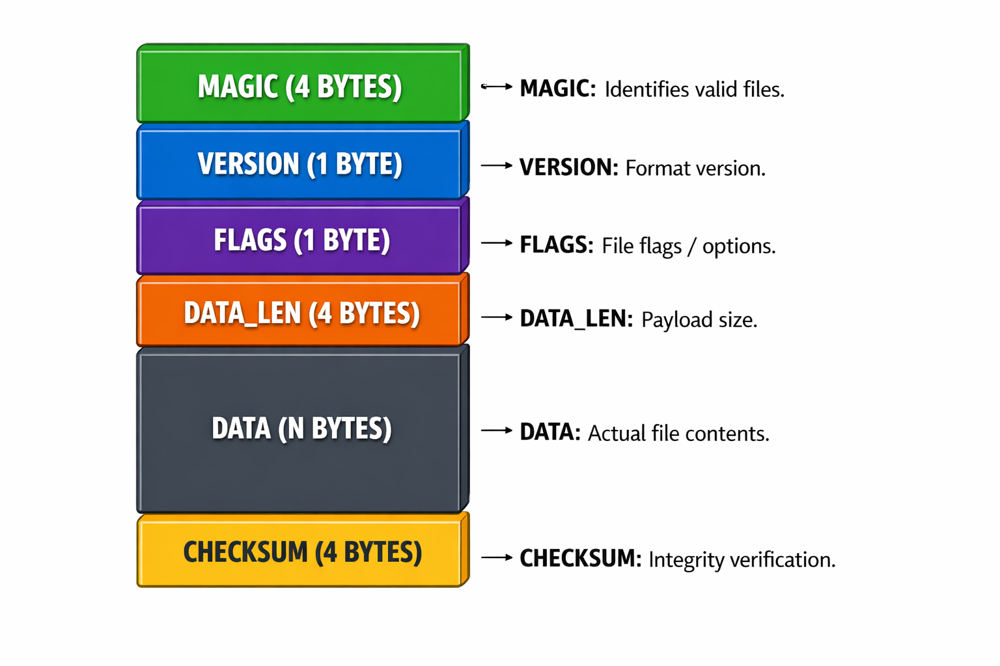

# Custom File Format Parser & Encryption Tool

A Java-based CLI tool that demonstrates binary file parsing, custom file format design,
and reversible key-based encryption using byte-level operations.

> ⚠️ Note: This project uses **educational custom encryption** and does not claim
> cryptographic security.

---

## 📌 Features

- Custom binary file format with header, metadata, payload, and checksum
- Byte-level parsing and validation
- Key-based XOR stream encryption & decryption
- Command-line interface (CLI)
- Robust error handling for corrupted or invalid files

---

## 🧱 File Format Specification

<p align="left">
  
</p>

---

## 🛠️ Tech Stack

- Java (Standard Library only)
- FileInputStream / FileOutputStream
- ByteBuffer
- Bitwise operations
- CRC32 checksum

---

## 🚀 Usage (CLI)

```bash
# Encode a file
java cli.Main encode sample.txt key123

# Decode a file
java cli.Main decode sample.encx key123
